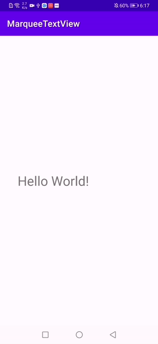

# MarqueeTextView

**TextView with horizontal scrolling (Scrolls regardless of whether the content is more than one line)**\
**走马灯式横向滚动的TextView（无论内容是否超过一行都会滚动）**

**注：编译此项目请直接 clone 父工程 [AndroidLibraries](https://github.com/dreamgyf/AndroidLibraries)**



## Get Started 快速使用

```groovy
implementation 'com.dreamgyf.android.ui.widget:MarqueeTextView:1.1'
```

```XML
<com.dreamgyf.marqueetextview.MarqueeTextView
    android:id="@+id/tv"
    android:layout_width="match_parent"
    android:layout_height="wrap_content"
    android:text="Hello World!" />
```

## Layout properties 布局属性

- `app:space`

Description: The minimum distance between heads and tails of text scrolling\
Type: dimension\
Default value: 100px

描述：文字滚动时，头尾的最小间隔距离\
类型：dimension\
默认值：100px

- `app:speed`

Description: Speed of text scrolling\
Type: float\
Unit: DP\
Default value: 0.5

描述：文字滚动速度\
类型：float\
单位：DP\
默认值：0.5

## Public method 公有方法

`void startScroll()`

`void pauseScroll()`

`void stopScroll()`

`void restartScroll()`
